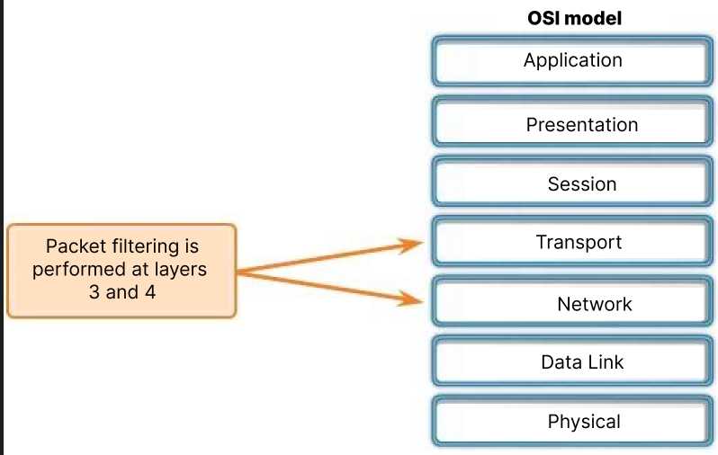

Security on each individual device remains essential, but it cannot be considered in isolation due to:

- **The number of devices** in many organizations.
- **Heterogeneous environments** with different operating systems and versions.
- **Users with administrative privileges** who may pose risks.

A firewall is a crucial tool that protects a network of interconnected systems and devices by controlling network traffic. While no current firewall fully meets all security requirements, they all strive to come as close as possible to the following key characteristics:

- All “inside to outside” and “outside to inside” traffic must pass through it.
- Only traffic authorized based on the security policy can continue.
- It must be completely unassailable.

## Advantages of Firewalls

- **Centralized Security Policy Enforcement**: Allow defining and enforcing security policies in a centralized manner.
- **Advanced Authentication**: Support advanced authentication techniques more efficiently and economically than if done on a per-device basis.
- **Centralization of Alarms and Logs**: Can centralize alarms and traffic logs, facilitating monitoring.
- **Lower Configuration Complexity**: Require less configuration compared to a general-purpose system.
- **Simple Maintenance**: Need few defined users for configuration and maintenance.

## Disadvantages of Firewalls

- **False Sense of Security**: Can induce a false sense of security if not complemented with other security measures.
- **Configuration Complexity**: More sophisticated firewalls may require complex configurations.
- **Bottleneck**: Can become a bottleneck for network traffic if not properly sized.

## Types of Firewalls

### 1. **Packet Filters**

- **Operation**: Operate at the network and transport layers, filtering IP packets based on values of certain fields in IP, TCP, or UDP headers.
- **Advantages**:
  - Simplicity and low cost.
  - Minimal impact on network performance.
- **Disadvantages**:
  - Limited inspection of packet content.
  - Vulnerability to IP spoofing attacks.

#### Example: `iptables` for Linux

### 2. **Stateful Inspection**

- **Operation**: Maintain a state table to track the state of active connections and make decisions based on the connection state.
- **Advantages**:
  - Greater security than basic packet filtering by tracking connections.
  - Better traffic control with context awareness.
- **Disadvantages**:
  - Higher resource usage.
  - More complex configuration.

#### Example: `Checkpoint Firewall-1`, `Cisco ASA`

### 3. **Application Layer Firewalls (Proxy Firewalls)**

- **Operation**: Operate at the application layer and inspect packet content to apply application-specific security policies.
- **Advantages**:
  - Deep inspection of application data.
  - Ability to filter specific content and commands.
- **Disadvantages**:
  - Can introduce latency.
  - Require more resources to manage.

#### Example: Proxy servers like `Squid`

### 4. **Next-Generation Firewalls (NGFW)**

- **Operation**: Integrate traditional firewall technology with additional features such as intrusion prevention, deep packet inspection, and application awareness.
- **Advantages**:
  - Comprehensive threat protection.
  - Application control and visibility.
- **Disadvantages**:
  - Higher cost.
  - More complex configuration and management.

#### Example: `Palo Alto Networks`, `Fortinet FortiGate`

## Firewall Architectures

### 1. **Single Firewall Architecture**

- **Description**: Suitable for small networks with a single control point.
- **Advantages**: Simplicity and lower cost.
- **Disadvantages**: Single point of failure.

### 2. **Dual-Homed Host Architecture**

- **Description**: A firewall with two network interfaces, one connected to the internal network and the other to the external network.
- **Advantages**: Provides a basic level of network isolation.
- **Disadvantages**: Limited scalability.

### 3. **Filtered Subnet Architecture (DMZ)**

- **Description**: Uses multiple firewalls to create a demilitarized zone (DMZ).
- **Advantages**: Enhanced security with multiple layers of protection.
- **Disadvantages**: Greater complexity and cost.

### 4. **Distributed Firewall Architecture**

- **Description**: Employs multiple firewalls throughout the network.
- **Advantages**: Granular control over network segments.
- **Disadvantages**: Complexity in management.

## Additional Considerations

### Firewall Policies and Best Practices

- **Policy Definition**: Develop effective firewall policies that balance security and usability.
- **Update and Review**: Importance of regularly updating and reviewing firewall rules to adapt to new threats.

### Real-World Scenarios and Case Studies

- **Example of Real Attacks**: Discussion of real attacks that could have been mitigated or prevented with proper firewall configurations.
- **Notable Incidents**: The SQL Slammer worm, which exploited vulnerabilities in firewall configurations.

### Limitations of Firewalls and Complementary Security Measures

- **Not a Standalone Solution**: Firewalls should be part of a broader security strategy.
- **Complementary Measures**: Include intrusion detection systems (IDS), intrusion prevention systems (IPS), and endpoint security solutions.

### Emerging Trends

- **Cloud Firewalls**: Mention of cloud-based firewalls that are increasingly relevant in cloud-based environments.
- **Virtual Firewalls**: Consideration of virtual firewalls that offer flexibility in virtualized environments.

## Conclusion

In summary, firewalls are a fundamental component of network security, providing critical traffic control to protect organizations' digital assets. However, they must be part of a comprehensive security strategy that includes multiple layers of defense. Students should continue exploring advanced topics and configurations to deepen their knowledge and experience.
