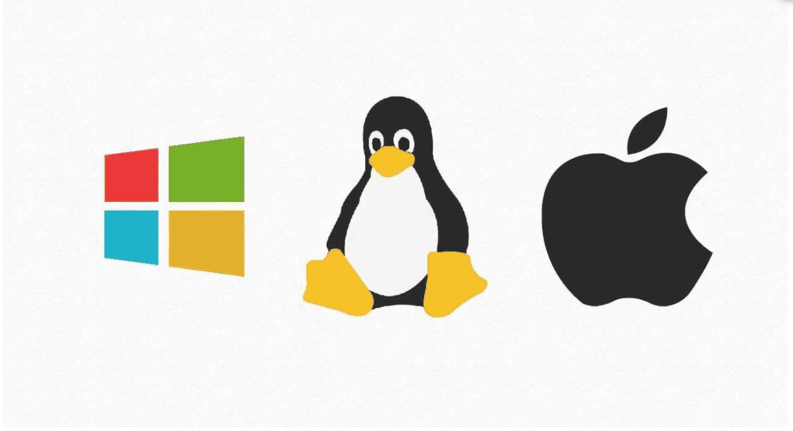
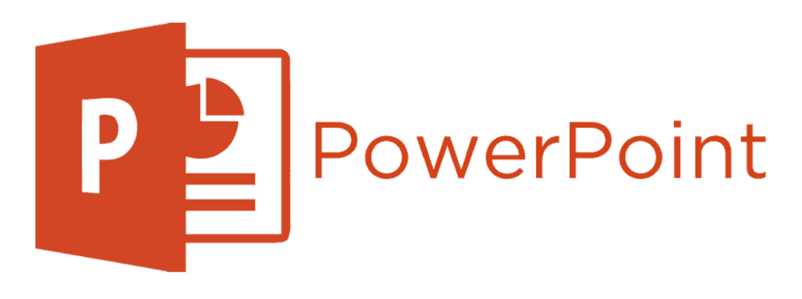

# Lectura 3 📕: Fundamentos de software

El **sistema operativo** es el **software** que coordina y dirige todos los servicios y aplicaciones que utiliza el usuario en una computadora, por eso es el más importante y fundamental. Se trata de programas que permiten y regulan los aspectos más básicos del sistema.

Los sistemas operativos consisten en interfaces gráficas, entornos de escritorio o gestores de ventanas que brindan al usuario una representación gráfica de los procesos en marcha. También puede ser una línea de comandos, es decir, un conjunto de instrucciones ordenado según su prioridad y que funciona en base a órdenes introducidas por el usuario.

### Entre los sistemas operativos más conocidos tenemos:

- **Windows**

Windows es un sistema operativo desarrollado por la compañía estadounidense Microsoft. Surgido durante la década de los 80, su popularización fue tal que llegó a alcanzar el 90% de la cuota de mercado de sistemas operativos en todo el mundo. Su característica más destacable (de la cual extrae el nombre) es una interfaz gráfica basada en la navegación por ventanas (tareas), dejando atrás a las secuencias de comandos y proporcionando un grandísimo éxito.

Dentro del sistema operativo se han incluido aplicaciones específicas desarrolladas por Microsoft como un navegador web, reproductor de vídeos, programa de seguridad.

Windows es uno de los sistemas operativos más populares en el mercado. Con varias versiones disponibles, como Windows 8, Windows 10 y Windows 11, ha capturado una parte significativa del mercado de sistemas operativos, ocupando actualmente alrededor del 70% del mismo.

- **macOS**

MacOS es un sistema operativo diseñado por Apple que está instalado en todos los equipos creados por la compañía Apple Inc, y son conocidos generalmente como **Mac**.

El sistema operativo es aquello que te permite realizar todas las tareas en un computador, como jugar, escuchar música, ver y editar imágenes, entre muchas otras cosas.

A diferencia del sistema operativo Windows que puede ser usado en equipos de diferentes fabricantes (DELL, Lenovo, etc), macOS está diseñado específicamente para computadores fabricados por Apple. Esto implica que el hardware y el software son totalmente compatibles, por este motivo el ordenador tiene un mejor funcionamiento y puede procesar información más rápido.

MacOS es un sistema operativo diseñado por Apple que está instalado en todos los equipos creados por la compañía Apple Inc., y son conocidos generalmente como Mac.

- **Linux**

GNU/Linux (pronunciado oficialmente como ñu linux o también ge-ene-u linux en español), es una familia de sistemas operativos tipo Unix compuesto por software libre y de código abierto. GNU/Linux surge de las contribuciones de varios proyectos de software, entre los cuales destacan GNU (iniciado por Richard Stallman en 1983) y el núcleo Linux (iniciado por Linus Torvalds en 1991).

A pesar de que en la jerga cotidiana la mayoría de las personas usan el vocablo Linux para referirse a este sistema operativo, en realidad ese es solo el nombre del kernel o núcleo, que representa menos del 50 por ciento de todo el código del sistema. El sistema completo está formado también por una gran cantidad de componentes del Proyecto GNU junto a componentes de terceros, que van desde compiladores hasta entornos de escritorio. Cabe señalar que existen derivados que usan el núcleo Linux pero que no tienen componentes GNU, como por ejemplo el sistema operativo Android. También existen distribuciones de software GNU donde el núcleo Linux está ausente.

Los sistemas operativos GNU/Linux se encuentran normalmente en forma de compendios conocidos como distribuciones o distros. Entre las más populares se encuentran Debian, Ubuntu, Red Hat y Kali linux. El propósito de estas distribuciones es ofrecer GNU/Linux como un producto final para instalar o probar en un ordenador, cubriendo una gama de necesidades, las cuales van desde el uso cotidiano personal hasta aplicaciones muy específicas en ambientes especializados. Al sistema base las distros añaden su propia selección de aplicaciones y programas preinstalados (por ejemplo ambientes gráficos basados en X11, Gnome y KDE), o aplicaciones que pueden descargarse desde un repositorio para su posterior instalación.

    
- **Para Linux:**

1. Desde cualquier distribucion de Linux abre la terminal e introduce el comando **lscpu.**
    
    > Este comando te devolvera una lista desde la arquitectura del sistema, procesador, nucleos e hilos e informacion mas interesante como la lista de vulnerabilidades activas en el sistema 
    
2. En la terminal ingresa el siguiente comando sudo **dmidecode -- type memory | less.**
    
    > Este comando devolvera una lista detallada sobre la placa base, modelo, arquitectura, y todos los puertos que estan en uso y descripcion de la memoria RAM, como los slot y descripcion de cada memoria.
    
3. En la terminal agregar el comando **sudo dmidecode -t 16.**
    
    >Este comando devolvera una lista que incluye la cantidad maxima de RAM que puede soportar la placa madre 
    
- **Para MacOS**

1. Desde la terminal Mac agregas el siguiente comando **uname-a (all).**
    
    >Te devolvera listada toda la informacion de sistema, desde el tipo de arquitectura, procesador y memoria. hasta la version de terminal y BIOS.
    

> 👉 Es importante tener acceso a esta información, ya que los componentes de hardware de tu sistema pueden tener vulnerabilidades que los atacantes podrían aprovechar. Mantener tu sistema actualizado y seguro es esencial para protegerlo contra posibles amenazas.

En 2023 la marca de hardware GYGABYTE reporto una vulnerabilidad a nivel de BIOS con un software que ejecutan un programa en el PC que permite controlar y descargar las actualizaciones sin que el usuario se entere, este software permitiria que un atacante pueda instalar un malware que se ejecute cuando se encienda la pc 

En 2022 la marca Intel reporto 16 vulnerabilidades en cuanto a sus procesadores, incluyendo la familia de procesadores de 9na, 10ma y 11va generacion, los cuales tienen un impacto tan grande en la seguridad que **podrían eludir todas las medidas** interpuestas por hardware o software. 

Con estos casos, se entiende la importancia de conocer las caracteristicas de las PC para asi saber que vulnerabilidades se pueden explotar o se tienen que proteger.

## Aplicaciones de productividad: Conociendo a nuestros usuarios

**¿Qué son?**

Las aplicaciones de productividad son herramientas digitales que permiten a los usuarios aumentar su productividad al organizar, administrar y ejecutar tareas cotidianas.

Entre las aplicaciones aplicaciones de productividad más usadas podemos conseguir, procesadores de textos, hojas de calculos y presentacion. Veamos 

1. **Procesador de Texto**

Un procesador de texto es una aplicación informática que permite crear y editar documentos de texto en una computadora. Se trata de un software de múltiples funcionalidades para la redacción, con diferentes tipografías, tamaños de letra, colores, tipos de párrafos, efectos artísticos y otras opciones.

Los procesadores de texto cumplen con una función similar a la que cumplían las máquinas de escribir hace algunas décadas, aunque mucho más completa y compleja. En la máquina de escribir, por ejemplo, cada letra tipeada por el usuario era impresa de forma inmediata en el papel, lo que imposibilitaba la posibilidad de borrar.

**Entre los procesadores de textos más conocidos tenemos :**

- Microsoft Word

Quizá el más popular a nivel mundial, Word es el más completo procesador de texto en la actualidad. Está diseñado para ayudar a crear documentos de calidad profesional, con las mejores herramientas de formato de documentos, ayuda a organizar y escribir sus documentos de forma más eficaz. 

> 👉 Word es un software de pago, se utiliza bajo la compra de una licencia de uso.

- Apache OpenOffice Writer

Writer tiene todo lo que se espera de un procesador de textos moderno completamente equipado. Su uso es totalmente gratuito ya que es de licencia libre.

Suficientemente simple para un memorándum y suficientemente poderoso para crear libros con contenido, imágenes, diagramas, índices, etc. Writer también puede mostrar múltiples páginas mientras edita. Ideal para modificar documentos complejos o si tiene un monitor grande o varios monitores

1. **Hojas de cálculo**

Una hoja de cálculo es un tipo de documento que permite manipular datos numéricos y alfanuméricos dispuestos en forma de tablas compuestas por celdas, las cuales se suelen organizar en una matriz de filas y columnas.

La celda es la unidad básica de información en la hoja de cálculo, donde se insertan los valores y las fórmulas que realizan los cálculos. Habitualmente es posible realizar cálculos complejos con fórmulas y/o funciones y dibujar diferentes tipos de gráficas.

**Entre las hojas más populares tenemos:**

- Microsoft excel

Con Excel, uno de los programas de hojas de cálculo por excelencia que es usado en pequeñas y grandes empresas y en la mayoría de las oficinas.

Estas hojas pueden ser creadas con plantillas y herramientas adicionales que hacen más fácil el proceso y el trabajo en general. En este programa puedes insertar gráficos de barras, circulares, gráficas de líneas y más. Tiene tablas dinámicas que llevan por nombre "pivote", con las cuales se analizan grandes cantidades de datos para luego presentar reportes bastante complejos sin tener que escribir fórmulas.

- Google spreadsheet.

Este es un programa de hojas de cálculo que se incluye como parte del conjunto gratuito de Google Docs Editors basado en la web que ofrece Google.

La aplicación es compatible con los formatos de archivo de Microsoft Excel y permite a los usuarios crear y editar archivos en línea mientras colaboran con otros usuarios en tiempo real. Las ediciones son rastreadas por el usuario con un historial de revisión que presenta los cambios.

1. **Aplicaciones de presentación**

Un programa de presentación es un tipo de software o aplicación informática utilizada para exponer información mediante un conjunto de diapositivas.

Típicamente, un programa de presentación incluye tres funciones principales, estas son:

- Un editor que permite insertar textos y darle formateo.

- Un método para insertar y manipular imágenes y gráficos.

- Un sistema para mostrar el contenido en forma continua.

**Entre los mas conocidos estan:**

- Microsoft Powerpoint

Esta herramienta forma parte del paquete de software de Microsoft Office, en él podemos crear presentaciones, también tiene la opción de personalizar y agregar animaciones a las presentaciones. Dado que está completamente integrado con las otras herramientas de la suite de Microsoft Office, se puede importar contenido creado con Excel o Word a PowerPoint, así como otros medios como imágenes, audio y videoclips.

Además, presenta una serie de plantillas para proporcionar al usuario diseños predefinidos para diferentes propósitos.

Durante una presentación de Microsoft PowerPoint, el presentador tiene la libertad de definir el ritmo controlando el flujo de las diapositivas manualmente o haciendo que se cambie a intervalos preestablecidos.

- Google slides

Google Slides o Presentaciones de Google es un servicio que te permite crear un soporte visual online para tus presentaciones. Puedes crear y editar tus diapositivas de forma individual o en equipo, a través de un ordenador, un teléfono móvil o una tableta.

Para acceder a esta aplicación se puede hacer mediante la página de Google Slides. Ahí puedes crear y compartir una nueva presentación de Google, ver las plantillas disponibles y acceder a tus presentaciones recientes. Todas las modificaciones que realices en una presentación se guardarán de forma automática.

## **Software de seguridad**

Los software de seguridad informática son herramientas que permiten minimizar los riesgos ante amenazas de la red y garantizar la seguridad de los datos que manejamos a nivel personal y nivel empresarial.

Existen distintos tipos de software de seguridad, entre los cuales tenemos:

- **Antivirus**

Los antivirus informáticos son piezas de software de aplicación cuyo objetivo es detectar y eliminar de un sistema computarizado los virus informáticos. Es decir, se trata de un programa que busca poner remedio a los daños causados por estas formas invasivas de software, cuya presencia en el sistema no suele ser detectable sino hasta que se evidencian sus síntomas, tal y como los virus biológicos.

Estas piezas de software pueden ser adquiridos a través de diversas empresas de programación comercial para garantizar el monitoreo, limpieza y protección de los computadores.

Por lo general estos antivirus ofrecen servicios de monitoreo activo, para impedir el acceso total de un documento infectado al sistema, bloquear páginas web inseguras y eliminar archivos riesgosos apenas ingresen al computador. A esto suele llamársele protección activa.

Por otro lado, los antivirus informáticos lidian también con otras piezas de software no deseado, como el spyware, malware o rootkits, e incluso de intentos de hackeo. Para ello posee un **firewall** (software de bloqueo de conexiones remotas) y una base de datos de definiciones de virus, que es una suerte de enciclopedia de los virus ya conocidos. 

Algunos programas de seguridad informática que se utilizan para proteger las computadoras contra virus y otras amenazas en línea son:

1. Norton.
2. Bit defender.
3. McAfee.
4. Windows defender.

- **Firewall**

Es un sistema de seguridad de red de las computadoras que restringe el tráfico de Internet entrante, saliente o dentro de una red privada.

Este software o esta unidad de hardware y software dedicados funciona bloqueando o permitiendo los paquetes de datos de forma selectiva. Normalmente, su finalidad es ayudar a prevenir la actividad maliciosa y evitar que cualquier persona (dentro o fuera de la red privada) pueda realizar actividades no autorizadas en la web, podemos considerarlas fronteras o puertas que administran el flujo de la actividad web que se permite o prohíbe en una red privada.

El término proviene del concepto de paredes físicas que actúan como barreras para ralentizar la propagación del fuego hasta que los servicios de emergencia puedan extinguir. En comparación, los firewalls de seguridad de red sirven para la administración del tráfico web y normalmente están destinados a ralentizar la propagación de las amenazas web.

Los firewalls crean “cuellos de botella” para canalizar el tráfico web. En esos puntos, se realiza una revisión según un conjunto de parámetros programados y se actúa en consecuencia. Algunos firewalls también realizan un seguimiento del tráfico y las conexiones en los registros de auditoría para consultar lo que se ha permitido o bloqueado.

Un firewall está diseñado para controlar o filtrar qué comunicaciones se permiten dentro y cuáles se permiten fuera de un dispositivo o red. Se puede instalar un firewall en una sola computadora con el propósito de proteger esa computadora (firewall basado en host) o puede ser un dispositivo de red independiente que protege una red completa de computadoras y todos los dispositivos host en esa red (firewall basado en red).

**Ejecicio:** Investiga los diferentes tipos de firewall que existen y su configuracion.

## 🔎 Laboratorio

**Descubre como ver la información de tu hardware en tu computador:**

- **Para Windows:**

1. Presiona en tu teclado los botones **`win + r`** e introduce en la ventana **msinfo32** para ver información interna como el procesador, versión del software y cantidad de **RAM**.

2. Presiona en tu teclado en tus botones **`win + r`** e introduce en la ventana **cmd.**
    Abrirá la terminal de Windows e introduce el comando **systeminfo**, tendrás información desde nombre del host hasta versión de BIOS
    
3. En la misma terminal ingresa el comando ***wmic memphysical get MaxCapacity***, ***MemoryDevices.*** 
    
    > El comando te devolverá la cantidad máxima de RAM que soporta la placa base y la cantidad de slot disponibles, este es un comando muy útil si planeas mejorar la memoria RAM de tu equipo. La cantidad máxima (MaxCapacity) esta expresada en Kb por lo que tendrás que dividir por 1024 para hacer la transformación a Mb y nuevamente dividir por 1024 para tener la cantidad en Gigabytes.